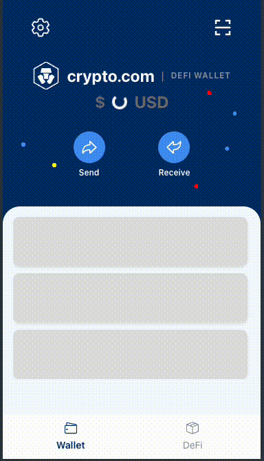

# Crypto Wallet Test

[En](README.md) | [繁中](README-hk.md) | [簡中](README-cn.md)

This is an interview coding test

## Operating Environment
* Chrome v49+ or Firefox v45+ or Safari v9+
* Node v22+

## Key Dependencies
- [react-icons](https://github.com/react-icons/react-icons/actions)
- [sass](https://github.com/sass/sass)
- [clsx](https://github.com/lukeed/clsx)
  
## Project Structure
- components -> Location for storing components
- hooks -> Location for storing hooks, currently only contains Redux hooks to avoid repetitive type checking
- pages -> Pages composed of components
- store -> Location for storing Redux and thunks
- services -> Layer that determines which service to use for data fetching

## Architecture Philosophy

- Separation of pages and logic: Pages are purely rendered using `.tsx`, while business logic is handled in `useXXXController.ts`, making it easier to implement testing later
- In business logic, after dispatching asynchronous calls to Store, the Service layer decides whether to fetch from local storage, Mock data, or eventually connect to actual backend using axios
- After retrieving data, it's asynchronously inserted through `extraReducers.ts`, ultimately driving UI changes. Any component listening to Redux will automatically update